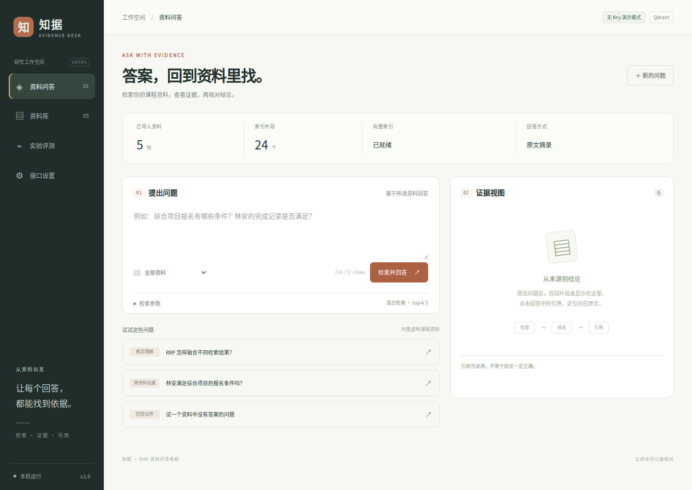

# 知据 · RAG 资料问答系统

面向课程讲义和作业资料的检索问答应用。上传文档后，可以提问、查看召回片段，并从回答中的引用回到原文。检索和回答是分开处理的，便于检查问题出在资料切分、证据召回还是模型生成。

**Python · FastAPI · Qdrant · Embeddings · BM25 · RRF · LLM API**

项目主要关注两件事：跨资料问题需要的证据能否完整召回，以及资料不充分时回答能否保持合理边界。仓库包含 18 道标注题、参数对照脚本和逐题实验记录。



[API 配置](#连接模型-api) · [评测与复现](#评测与复现) · [技术说明](docs/技术与评测说明.md) · [实验记录](reports/evaluation.md)

## 功能

- 导入 TXT、Markdown、含文字的 PDF 和 DOCX；保留页码、章节或段落位置。
- 使用 Qdrant 保存向量，支持向量检索、BM25 / RRF 混合检索、资料范围过滤和规则式问题拆分。
- 调整 chunk、overlap、top-k 和相似度阈值，观察证据覆盖的变化。
- 校验回答中的引用编号和逐字引文，点击引用查看原文，导出问答记录。
- 检查资料与索引是否一致；重建失败时保留原有索引。
- 比较不同检索参数，输出 JSON、CSV 和 Markdown 评测报告。

## 本地启动

需要 Python 3.10 及以上版本，推荐 3.12。

下载后完整解压，进入项目目录。Windows 可以双击 `启动.bat`；macOS 在终端执行 `bash 启动.command`；Linux 执行 `bash start.sh`。首次运行会创建 `.venv` 并安装依赖。

macOS 如需双击启动，先在项目目录执行一次 `chmod +x 启动.command`，赋予脚本执行权限，再双击。直接执行 `bash 启动.command` 不需要这一步。

也可以手动运行：

```bash
python -m venv .venv
```

Windows PowerShell：

```powershell
.\.venv\Scripts\Activate.ps1
```

macOS / Linux：

```bash
source .venv/bin/activate
```

安装并启动：

```bash
python -m pip install -r requirements.txt
python run.py
```

浏览器地址以终端 `Open:` 后显示的地址为准。默认端口是 8765，被占用时自动换端口；`python run.py --port 0` 可以直接申请空闲端口。关闭服务时在终端按 Ctrl+C。

首次启动会导入 5 份虚构课程资料并建立本地索引，无需 Docker 或 API Key。依赖安装完成后，默认模式可以离线使用。

## 运行模式

| 配置 | 向量来源 | 回答方式 |
| --- | --- | --- |
| `hash` + `extractive`，默认 | 中文二字组 / 英文词项特征哈希 | 摘录相关原文 |
| `hash` + `llm` | 本地特征哈希 | 模型根据召回证据生成回答 |
| `api` + `llm` | Embedding API 语义向量 | 模型根据召回证据生成回答 |

默认模式用于跑通流程和复现基线，不具备大模型推理能力。需要自行配置API Key，这个是个人的，我不提供。

## 连接模型 API

**API Key 填在项目根目录的 `.env` 文件中。网页的“接口设置”只展示当前配置，不负责保存密钥。**

### 1. 创建配置文件

第一次配置时，将 `.env.example` 复制为 `.env`。已有 `.env` 时直接编辑原文件。

Windows PowerShell：

```powershell
Copy-Item .env.example .env
notepad .env
```

macOS / Linux：

```bash
cp .env.example .env
```

用文本编辑器打开 `.env`。Windows 下确认文件名是 `.env`，不是 `.env.txt`。

### 2. 准备密钥和模型名

系统对接 OpenAI 兼容接口，使用两个独立配置：

| 用途 | 请求路径 | 环境变量前缀 |
| --- | --- | --- |
| 将资料和问题转换为向量 | `POST /embeddings` | `EMBEDDING_` |
| 根据证据生成回答 | `POST /chat/completions` | `LLM_` |

以硅基流动为例，在控制台的 API 密钥页面创建密钥，再从模型列表复制模型 ID。对话模型要能够返回 JSON；Embedding 要选择文本嵌入模型。两者使用同一服务商时可以填写同一把密钥，也可以分别接入不同服务商。

配置示例：

```dotenv
RAG_EMBEDDING_MODE=api
RAG_ANSWER_MODE=llm

EMBEDDING_BASE_URL=https://api.siliconflow.cn/v1
EMBEDDING_API_KEY=YOUR_API_KEY
EMBEDDING_MODEL=BAAI/bge-m3

LLM_BASE_URL=https://api.siliconflow.cn/v1
LLM_API_KEY=YOUR_API_KEY
LLM_MODEL=YOUR_CHAT_MODEL_ID
LLM_JSON_MODE=true
API_TIMEOUT_SECONDS=60

QDRANT_URL=
QDRANT_API_KEY=
```

将 `YOUR_API_KEY` 换成自己的密钥，将 `YOUR_CHAT_MODEL_ID` 换成控制台可用的对话模型 ID。`BAAI/bge-m3` 是嵌入模型示例，实际可用模型和价格以服务商控制台为准。

填写时注意：

- `BASE_URL` 填接口前缀，例如 `https://api.siliconflow.cn/v1`，不要再加 `/embeddings` 或 `/chat/completions`。
- Key 只填密钥本身，不加 `Bearer`，不在同一行末尾写注释。
- 如果只有对话 API，可以先保留 `RAG_EMBEDDING_MODE=hash`，只设置 `RAG_ANSWER_MODE=llm` 和 `LLM_` 配置；此时检索仍使用本地词面特征。
- `QDRANT_URL` 留空即使用本地向量库，不需要购买云数据库。
- 不支持 `response_format` 的服务可尝试 `LLM_JSON_MODE=false`，但模型仍必须按提示返回 JSON。不能把普通自由文本回答直接用于当前适配器。
- 操作系统环境变量优先于 `.env`。如果改了文件但配置没变，检查终端中是否设置过同名变量。

参考：[创建 API Key](https://docs.siliconflow.cn/docs/userguide/quickstart)、[对话接口与 JSON 输出](https://docs.siliconflow.cn/docs/userguide/capabilities/text-generation)、[Embedding 接口](https://api-docs.siliconflow.cn/docs/api/embeddings-post)。

### 3. 重启、重建索引并验证

1. 保存 `.env`，在原终端按 Ctrl+C 停止服务，再运行 `python run.py` 或启动脚本。
2. 打开“接口设置”，确认 Embedding 和回答模型显示的是所配置的模型名。
3. 切换 Embedding 模式、模型或地址后，在“资料库”点击“重建向量索引”。只更换 LLM 不需要重建。
4. 提问“RRF 怎样融合不同检索结果？”，检查回答、证据卡片和可点击引用是否正常显示。

接入外部 API 后，建索引会发送资料文本，问答会发送问题和召回片段。首次索引及后续调用可能产生服务商费用。仓库不附带密钥；接口处理和引用校验有模拟接口测试，尚未附带付费模型的实连评测结果。

### 常见配置问题

| 现象 | 检查方式 |
| --- | --- |
| 仍显示“原文摘录” | 确认 `RAG_ANSWER_MODE=llm`，保存后重启服务 |
| HTTP 401 / 403 | 检查对应服务商的 Key、账户权限和模型权限 |
| HTTP 404 | 检查模型 ID、BASE_URL，以及是否重复填写了接口路径 |
| HTTP 429 | 检查额度和调用频率，稍后再试 |
| 请求超时 | 检查网络；可将 `API_TIMEOUT_SECONDS` 改成 120，允许范围为 5–300 |
| 模型未返回有效 JSON | 换用支持 JSON 输出的模型，或按服务商文档调整 `LLM_JSON_MODE` |
| 引用编号或引文与原文不符 | 接口已返回，但内容没有通过引用校验；查看证据是否充分，再调整问题、top-k 或模型 |
| 提示索引过期 | 在资料库重建索引；不要混用不同 Embedding 模型的向量 |

## 评测与复现

```bash
python -m unittest discover -s tests -v
python scripts/evaluate.py
```

默认评测使用独立临时 Qdrant 和内置资料，不修改日常知识库，也不调用外部模型。对照参数为 chunk 240 / 420 / 700 字符、top-k 3 / 5、vector / hybrid，共 12 组 × 18 道题。overlap 固定 60 字符，余弦阈值为 0.08。

更多参数对照：

```bash
python scripts/evaluate.py --sizes 240 420 700 --top-k 1 3 5 --thresholds 0.06 0.12 --out reports/sweep
python scripts/evaluate.py --no-expand --out reports/no_expand
```

使用自定义资料和标注集：

```bash
python scripts/evaluate.py --samples ./my_samples --dataset ./my_questions.json --out reports/custom
```

确认 `.env` 配置有效后，可以运行实连模型评测：

```bash
python scripts/evaluate.py --live --sizes 420 --top-k 5 --strategies hybrid --out reports/live
```

`--live` 会调用外部 API。仓库已有的 [评测记录](reports/evaluation.md) 来自默认模式下的小规模合成资料；证据召回、完整证据率和拒答率分别统计，不能用引用格式通过率代替答案准确率。指标定义见 [技术与评测说明](docs/技术与评测说明.md)。

## 代码结构

| 路径 | 内容 |
| --- | --- |
| `rag/documents.py` | 文档解析、切分、原文位置和可疑片段标记 |
| `rag/models.py` | 向量缓存、模型 HTTP 接口、提示词和引用校验 |
| `rag/engine.py` | Qdrant 索引、BM25 / RRF、资料管理和问答编排 |
| `rag/evaluation.py` | 问题—证据标注匹配、参数对照和报告导出 |
| `rag/app.py` | FastAPI 接口和本机访问约束 |
| `web/` | HTML / CSS / JavaScript 界面 |
| `samples/`、`eval/` | 虚构演示资料与标注集 |
| `tests/` | 文档、检索、引用、API 适配和启动测试 |
| `docs/`、`reports/` | 技术说明、界面截图和实验记录 |

## 当前限制

- 扫描版 PDF 需要先 OCR；DOCX 使用段落和表格位置，不还原 Word 页码。
- 默认摘录模式可能把相关资料误当成充分答案。例如询问资料中未提供的个人信息时，可能返回姓名相关的其他记录。
- 引用校验能检查来源和逐字引文，不能证明结论在逻辑上成立。复杂条件推理仍需人工评审。
- 提示注入筛查基于部分已知模式，覆盖范围有限。
- 目前面向本机单用户，单文件上限 10 MB，未实现多用户账号和公网部署。

运行数据保存在 `data/`，`.env` 和 `data/` 均已加入忽略规则。Qdrant 本地模式不能由多个进程同时打开同一数据目录；需要清空实验数据时，先关闭服务，再移走或删除 `data/`。

## 许可证

本项目采用 [MIT License](LICENSE)。第三方依赖遵循各自的许可证。
